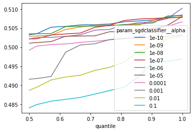

# investigation

Details involving the selection of model architecture and values of
hyper-parameters.

## Problem

Two textual datasets are given which contain answers to questions for indicators
on the political compass model. The society dataset has classes -1 representing
a liberal answer and 1 indicating a conservative answer. The economy dataset has
classes -1 representing a libertarian answer and 1 indicating an authoritarian
answer.

## Goal

Create a simple, small, fast, and accurate regression-like model for each axis.
I opted for a probabilistic classifier instead of a regression for ease of
implementation and the ability to weight samples more easily. Since there are
two axes, two models are required: one for the society axis and one for the
economic axis. Since the goal is to be distributed through the web, both models
together should be less than approximately 5MB. For speed and ease, ease of
implementation, and ability to optimize
[stochastic gradient descent](https://en.wikipedia.org/wiki/Stochastic_gradient_descent)
would work well for the implementation. This also fits the additional criteria
for creating an
[online algorithm](https://en.wikipedia.org/wiki/Online_algorithm). The
precision metric of accuracy was the most important for evaluating models. When
considering a document as potentially biased I'd prefer false negatives over
false positives.

## Model Architecture

Several pipeline architectures were considered. They included options of a
counting or hashing vectorizer, a TFIDF transformer, and both of the models.
More advanced techniques were discarded because of their size and difficulty of
implementation. The hashing vectorizer was preferred over the counting
vectorizer for both its speed and minimal size given that individual tokens do
not have to be stored. The TFIDF transformer was discarded because it would
require an additional vector or two to be sent to the client containing the
document frequencies depending on if it was fit on each dataset together or
separately. The count vectorizer and TFIDF transformer were able to improve
accuracy, however, it didn't seem worthwhile compared to its cost of
implementation, speed, and size. An additional bonus of using the hashing
vectorizer is that there is no need to consider fitting two vectorizers - one
for each dataset - or one on both datasets since it is stateless. Given all of
these considerations the model architecture would include a shared hashing
vectorizer and both binary classifiers.

## Hyper-Parameters

Python along with the scikit-learn Python package was used to determine
appropriate hyper-parameters. Similar scripts to the ones used to determine
hyper-parameters are included in this directory. Some notes are shared below.

## Hashing Vectorizer - strip_accents

Stripping accents was able to barely reduce the amount of unique tokens for the
dataset. Since this seemed to remove negligible information from the feature
vectors it was used. There is also the possibility that an accentuated word was
used in place of a non-accentuated word. In this case colliding the two words
for the model would be beneficial.

## Hashing Vectorizer - lowercase

This was able to slightly reduce the amount of unique tokens. This reduced the
amount of unique tokens more than stripping accents. Because casing did not seem
to include very much information it was removed. Although it could increase
accuracy, there is the possibility that leaving casing as is would cause the
model to not recognize a token it has seen before. This is especially important
given the limited size of the dataset.

## Hashing Vectorizer - stop_words

Using the `"english"` stop words was able to massively decrease the number of
unique tokens for bigrams and trigrams. Since I opted to use monograms I did not
use any stop words. This would have also added quite a bit of hard coded
JavaScript in the end model which was nice to avoid. There is also the widely
held opinion that the `"english"` stop words provided by default in scikit-learn
is too broad which could remove necessary information from the feature vectors.

## Hashing Vectorizer - token_pattern

The default token pattern seemed robust with its use of the word character class
and word breaks. Since it only tokenizes words with at least two characters it
could potentially reduce noise in the dataset when people add single characters
with spaces to make up for the minimum word counts enforced by sources of the
data.

## Hashing Vectorizer - ngram_range

Using longer ngrams was able to convey more information in the feature vectors.
Additionally, it could potentially convey information provided by the order in
which words are said which is unavailable for monograms. A good example of this
would be negations such as 'not good'. Due to the size constraints of the model
the additional information and accuracy provided by ngrams larger than monograms
was not worthwhile.

## Hashing Vectorizer - analyzer

Using anything other than word would have taken up far too many unique token
hashes to be worth it. Using character grams could have provided a more robust
model for improper spelling, however, this was not a huge consideration since
the training data was spell checked. Also, the intended applications of the
model could be safely assumed to have proper spelling of keywords.

## Hashing Vectorizer - n_features

The model weight matrices are going to be sent to the client as a dense vector.
Because of this using as few features as required is preferred. The amount of
features shouldn't be too low though as that would cause collisions. This would
cause the model to confuse some words with others which could negatively impact
accuracy. This is especially important if it is a token that the model wasn't
trained on which could skew the result in the incorrect direction.

As an approximate happy medium between space and accuracy I aimed for collisions
to affect maybe ten percent of the tokens for the training dataset. For
monograms this was approximately 2^16 or 65,536. For bigrams this was
approximately 2^19 (524,288) to 2^20 (1,048,576). For trigrams this was about
2^21 (2,097,151). Given the 5MB limit placed on both models, the value of
`n_features` is limited to 2^19. Using 32 bit floats, each model weight vector
would be 2MB for 2^19 as `n_features`. Together this would total 4MB which is
just under the 5MB limit. Although longer ngrams could improve accuracy, the
amount of `n_features` required to uniquely hash them was too great to consider
their use. Bi-grams could almost be considered, but the improved accuracy wasn't
enough to justify their use even if they came in under the limit. Below is a
visual generated from the `hashing_collisions.py` script that was used to help
consider this parameter with respect to collisions.

One thing to note is that using extremely small values for `n_features` seemed
to improve accuracy. My hypothesis for this is that it was performing some sort
of naive dimensionality reduction. Since this could have unexpected results on
different applications of the model this was not taken advantage of.


## Hashing Vectorizer - binary

The scikit-learn documentation states that binary counts could work well for
some probabilistic models. That was found to be true for these datasets as well.
Another benefit of using binary feature vectors is the ease of implementation.

## Hashing Vectorizer - norm

Because of the use of binary feature vectors normalizing the vectors is
unnecessary. A norm of a binary vector could be expressed nearly equivalently by
scaling the weights of the model for documents with token counts of similar
sizes. Any small improvement in accuracy from changing the `norm` in
scikit-learn was assumed to be from noise.

## Hashing Vectorizer - alternate_sign

Although hypothetically useful, alternate sign did not appear to provide a
tangible increase in accuracy. Since this would make implementation more complex
it was not used.

## Hashing Vectorizer - dtype

The 32 bit float was used in place of the 64 bit float due to its smaller size.
Any possible precision loss was considered negligible.

## Hashing Vectorizer Parameters

The final parameter selection is shown below.

```python
import numpy as np
from sklearn.feature_extraction.text import HashingVectorizer

HashingVectorizer(
    strip_accents='unicode',
    lowercase=True,
    stop_words=None,
    ngram_range=(1, 1),
    norm=None,
    n_features=2**16,
    binary=True,
    alternate_sign=False,
    dtype=np.float32,
)
```

## SGD Classifier - loss

Both `"log"` loss and `"modified_huber"` loss were the main considerations given
the probabilistic properties as mentioned in the
[scikit-learn sgd documentation](https://scikit-learn.org/stable/modules/generated/sklearn.linear_model.SGDClassifier.html).
The scikit-learn description of `"modified_huber"` also describes its tolerance
to outliers. Due to its tolerance to outliers as well as improved performance
seen in testing the `"modified_huber"` loss was chosen.

## SGD Classifier - penalty

The l2 penalty appeared to provide some benefit over other methods. Since both
l1 and l2 regularization both use the elastic net implementation with different
ratios under the hood, grid search can be simplified by only using elastic net
and then searching for l1_ratios between 0.0 and 1.0.

## SGD Classifier - alpha

Generally very low values for the regularization parameter seemed to fair
better. Although generally lower values did better, I stuck with a relatively
higher value of 1e-6. This is based on the suggestion from the
[scikit-learn sgd user guide](https://scikit-learn.org/stable/modules/sgd.html#sgd)
that recommends between `1e-1` to `1e-7` for the alpha parameter. Here is a
visualization of the weighted f1 score quantile vs weighted f1 score of multiple
models. It shows that as higher quantiles are taken, lower values fair better.
The `1e-6` value coming out in the lead is probably due to noise.



## SGD Classifier - fit_intercept

Fit intercept seemed to negligibly affect accuracy metrics. Since it introduced
some added complexity to the implementation it was not used.

## SGD Classifier - learning_rate

The
[scikit-learn sgd user guide](https://scikit-learn.org/stable/modules/sgd.html#sgd)
suggests that a constant learning rate can be used with average stochastic
gradient descent. I found this to be the case here as well where the
`"constant"` and `"optimal"` choices faired particularly well. Since the
`"constant"` learning rate was easy to implement it was used.

## SGD Classifier - eta0

The
[scikit-learn sgd user guide](https://scikit-learn.org/stable/modules/sgd.html#sgd)
mentions that higher values for the initial learning rate did well with average
stochastic gradient descent. This seemed to be somewhat true with this data set
as well. The very high values didn't seem to affect the end accuracy metric very
much as shown below by a plot of `eta0` versus weighted f1 score for a
`"constant"` learning rate.

`[plot of et0 vs weighted f1 score](images/eta0_comparison.png)

## SGD Classifier - warm_start

The warm start parameter seemed to negligibly affect accuracy metrics. Since it
introduced some added complexity to the implementation it was not used.

## SGD Classifier - average

The average parameter seemed to allow the model to perform well and improve the
robustness of the model. Waiting for a certain sample to begin averaging did not
appear to have a significant effect.

## SGD Classifier Parameters

The final parameter selection is shown below.

```python
from sklearn.linear_model import SGDClassifier

SGDClassifier(
    alpha=1e-6,
    fit_intercept=False,
    loss='modified_huber',
    learning_rate='constant',
    average=True,
    1e-3e-3,
)
```

## Further Improvements

Below is a comparison between the ASGD model with the above parameters and an
SVM which is not limited to the same constraints. The model weights were
balanced using solely the target column instead of both the target column and
the question column. The manually generated testing datasets were not used for
this experiment. The script used to generate this visual is provided as
`learning_curve.py`. It is based on this
[scikit-learn guide](https://scikit-learn.org/stable/auto_examples/model_selection/plot_learning_curve.html#sphx-glr-auto-examples-model-selection-plot-learning-curve-py).
It takes about a minute to run.

Although the TFIDF feature vectors used for the SVM are theoretically better
than the hashing vectors used for the ASGD model, the appeared to scale worse
for when more samples were used. This is shown by the training score decreasing
more rapidly than for the ASGD model. The above guide says this is due to the
complex nature of the dataset which is understandable given its textual nature.

The SVM model took less time to vectorize and fit to the data than the SGD which
was not expected. The hashing vectorizer is still significantly smaller and
allows for out-of-core classification which is not possible with the TFIDF
vectors and SVM.

Overall, the SVM provided a slightly better weighted f1 score which was expected
given it was not limited in the same way that the ASGD model was. Since the
model did not appear to reach its asymptotic limit for the dataset I expect more
training samples could further improve its accuracy. Additionally, given enough
samples using other parameters for the vectorizer could be worthwhile.
